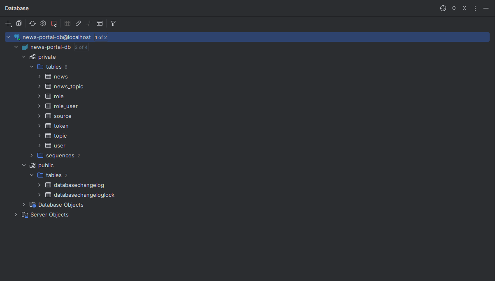
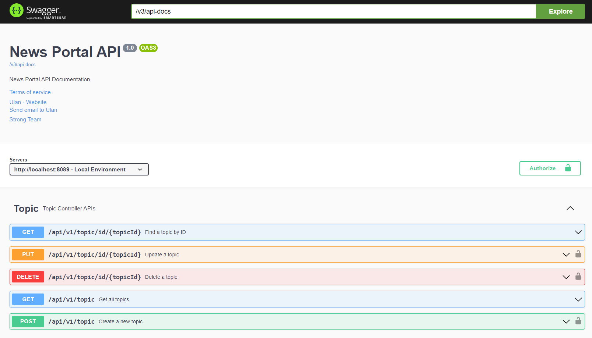

# Backend Test Assignment

[](https://linkedin.com/in/ulan-kozhabekov-7b7991217/)
[](https://www.instagram.com/ulaburrito/)
[](https://t.me/nadevvo)


 Выполнил задание Улан Кожабеков

 ulankdt@gmail.com | +77087314002

---

# Применение

```
docker compose -f docker-compose-local.yml up -d
```

NOTE: Проверьте доступен ли внейшний порт <code> 5433 </code>

Дальше запустите проект и запуститься миграция всех таблиц с помощью **Liquidbase**.

Liquibase - это инструмент для управления миграциями баз данных. Он позволяет разработчикам и администраторам баз данных
управлять изменениями в базах данных в контролируемой и систематической манере. С помощью Liquibase можно создавать,
изменять и откатывать изменения в базах данных.

После запуска скриптов финальный результат будет такие:



Если у вас не видна схема <code>private</code>, то нажмите на <code>1 of 4</code> и там в схема нажмите галочку.

- Схема private - для работы с бизнес логики
- Схема public - для changelog-ов

## Документация для запросов

Swagger OpenAPI - это спецификация, которая позволяет описывать RESTful API в машиночитаемой форме. Swagger позволяет
разработчикам и пользователям легко понимать, как работает API, какие запросы можно отправлять и какие данные получать в
ответ.

Ссылка для OpenAPI:

```
http://localhost:8089/swagger-ui/index.html#/
```

Для того, чтобы получить доступ к защищенным запросам (POST, PUT, PATCH, DELETE), необходимо получить токен.

Ниже приведена таблица с котроллерами и их описанием:

| Контроллеры           |                          Описание                           |
|:----------------------|:-----------------------------------------------------------:|
| **Auth Controller**   |          Контроллер _для авторизации пользователя_          | 
| **News Controller**   |                  Контроллер _для новостей_                  | 
| **Source Controller** |            Контроллер _для источников новостей_             | 
| **Topic Controller**  |                Контроллер _для тем новостей_                | 
| **Demo Controller**   | Контроллер _для проверки работоспособности Spring Security_ | 

---

